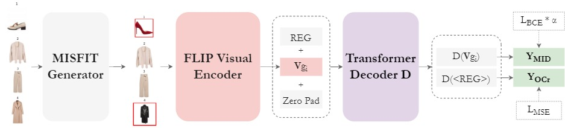
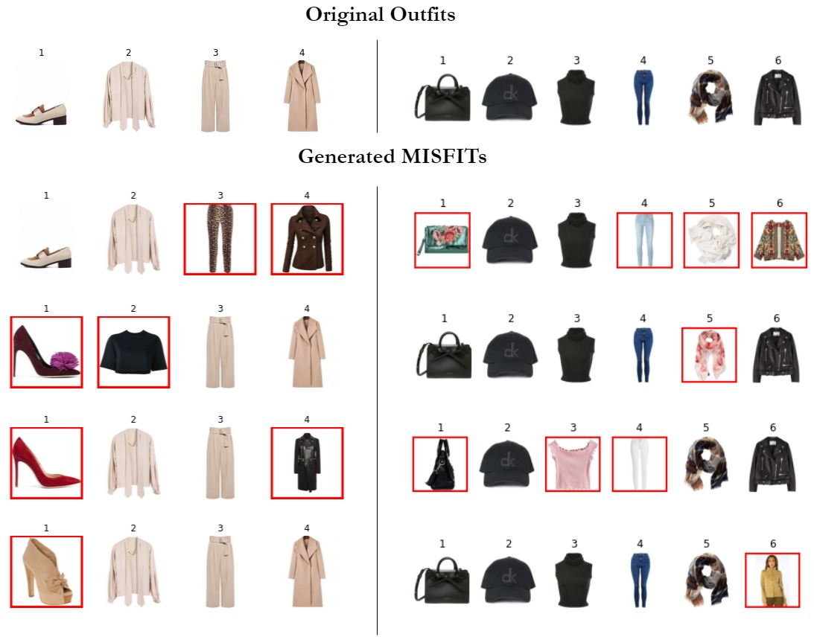

# Visual-InCompatibility-Transformer
Repository for the "VICTOR: Visual Incompatibility Detection with Transformers and Fashion-specific contrastive pre-training" paper. The pre-print can be read here: https://arxiv.org/abs/2207.13458

## Abstract
>*For fashion outfits to be considered aesthetically pleasing, the garments that constitute them need to be compatible in terms of visual aspects, such as style, category and color. Previous works have defined visual compatibility as a binary classification task with items in a garment being considered as fully compatible or fully incompatible. However, this is not applicable to Outfit Maker applications where users create their own outfits and need to know which specific items may be incompatible with the rest of the outfit. To address this, we propose the Visual InCompatibility TransfORmer (VICTOR) that is optimized for two tasks: 1) overall compatibility as regression and 2) the detection of mismatching items and utilize fashion-specific contrastive language-image pre-training for fine tuning computer vision neural networks on fashion imagery. We build upon the Polyvore outfit benchmark to generate partially mismatching outfits, creating a new dataset termed Polyvore-MISFITs, that is used to train VICTOR. A series of ablation and comparative analyses show that the proposed architecture can compete and even surpass the current state-of-the-art on Polyvore datasets while reducing the instance-wise floating operations by 88%, striking a balance between high performance and efficiency.*



## Preparation

- Clone this repo: 
```
git clone https://github.com/stevejpapad/Visual-InCompatibility-Transformer
cd Visual-InCompatibility-Transformer
```
- Download the Polyvore dataset from https://github.com/mvasil/fashion-compatibility and extract the files in the `/data` folder. If a different folder is selected, update `data_path` in main.py.
- Create a python (> 3.8) environment (Venv or Anaconda) and install all dependencies with:
```
pip install -r requirements.txt
``` 
or
```
conda install --file requirements.txt
```
Moreover, you should follow the instructions provided https://github.com/openai/CLIP to install CLIP.

## Reproducibility
All experiments from the paper can be re-created by running 
```python main.py``` 
to first train the four FLIP computer vision models, extract the visual and textual features and then run the ablation and comparative experiments found in the paper. 

## Usage
- Fetch the polyvore dataset and generate the Polyvore-MISFITs dataset with m=4. 
```
from prepare_polyvore import fetch_features, fetch_polyvore
train_df, valid_df, test_df = fetch_polyvore(
      data_path=data_path,
      use_misfits=True,
      generate_per_outfit=4,
      limit_items=19,
      use_descriptions=False,
      polyvore_version="disjoint",
)
```
Examples of generated MISFITs:


- Fine-tune a computer vision model with fashion-specific contrastive language-image pre-training (FLIP):
```
from FLIP import train_flip
train_flip(
      choose_image_model="resnet18", 
      EPOCHS=20, 
      LEARNING_RATE=1e-4, 
      emb_size=512, 
      batch_size=32, 
      data_path=data_path
)
```
We experiment with four computer vision neural networks: `resnet18`, `tf_efficientnetv2_b3`, `vit_base_patch32_224` and `mixer_b16_224`.

- Once a FLIP model is trained and saved, visual features can be extracted by:
```
from FLIP import extract_visual_features
      extract_visual_features(
      data_path,
      choose_image_model,
      choose_text_model,
      pretraining_method,
      polyvore_version="nondisjoint", 
      FLIP_learning_rate=1e-4
)
```

- Training VICTOR[MTL] with multi-modal input on the Polyvore-MISFITs-disjoint dataset with m = 2 (generated items) and a = 0.2 (combining loss weight) and features extracted from FLIP-ResNet18. 

```
from VICTOR import run_experiment

run_experiment(
    data_path=data_path,
    use_MID_choices=[True],
    use_OCr_choices=[True],
    w_loss_choices=[0.2],
    use_misfits=True,
    pretraining_method="FLIP",
    polyvore_version="disjoint",
    choose_image_model="resnet18",
    choose_text_model="CLIP_Transformer",
    use_features=["images", "texts"],
    generate_per_outfit=2,
    EPOCHS=20,
    LEARNING_RATE=1e-4,
)
```

## Acknowledgements
This work is partially funded by the Horizon 2020 European project ``eTryOn - virtual try-ons of garments enabling novel human fashion interactions'' under grant agreement no. 951908.

## Licence
This project is licensed under the Apache License 2.0 - see the [LICENSE](https://github.com/stevejpapad/Visual-InCompatibility-Transformer/blob/main/LICENSE) file for details

## Contact
Stefanos-Iordanis Papadopoulos (stefpapad@iti.gr)
